<h1 align="center">
  <a href="https://ghostex.dev"></a> Ghostex
</h1>

<p align="center">
  <strong>The best all-in-one native agents workspace.</strong><br/>
  Agent chats, a code editor and a browser for every agent CLI and subscription you have, in one fast native window.
</p>

<p align="center">
  <a href="https://github.com/maddada/Ghostex/stargazers"><picture><source media="(prefers-color-scheme: dark)" srcset="https://shieldcn.dev/github/stars/maddada/Ghostex.svg?variant=secondary&mode=dark" /></picture></a>
  <a href="https://github.com/maddada/Ghostex/releases/latest"><picture><source media="(prefers-color-scheme: dark)" srcset="https://shieldcn.dev/github/release/maddada/Ghostex.svg?variant=secondary&mode=dark" /></picture></a>
  <a href="LICENSE"><picture><source media="(prefers-color-scheme: dark)" srcset="https://shieldcn.dev/github/license/maddada/Ghostex.svg?variant=secondary&mode=dark" /></picture></a>
  <br />
  <a href="#install"><picture><source media="(prefers-color-scheme: dark)" srcset="https://shieldcn.dev/badge/platforms-macOS%20%C2%B7%20Windows%20%C2%B7%20Linux%20%C2%B7%20Android%20%C2%B7%20iOS.svg?variant=secondary&mode=dark" /></picture></a>
</p>

<p align="center">
<a href="https://discord.gg/df7b3G92CS"><picture><source media="(prefers-color-scheme: dark)" srcset="https://shieldcn.dev/badge/Discord-Join%20the%20community.svg?variant=branded&logo=discord&mode=dark" /></picture></a>
</p>

<h3 align="center"><a href="#install"><ins>Download Ghostex</ins></a> &nbsp;·&nbsp; <a href="https://ghostex.dev">Website</a> &nbsp;·&nbsp; <a href="https://youtu.be/QzjFB4J6-8E">Watch the 3-minute tour</a></h3>

<div align="center">
  <table>
    <tr>
      <td width="50%" align="center"><a href="#a-real-chat-for-every-agent">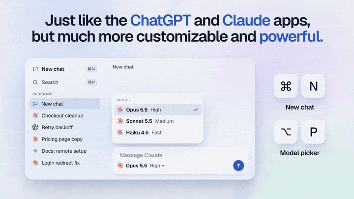</a></td>
      <td width="50%" align="center"><a href="#coordinators-that-run-the-work">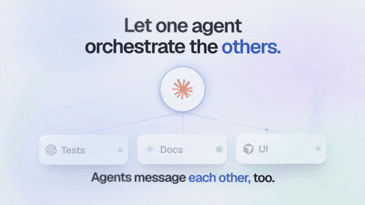</a></td>
    </tr>
    <tr>
      <td width="50%" align="center"><a href="#any-agent-swap-on-the-fly"></a></td>
      <td width="50%" align="center"><a href="#a-real-browser-next-to-your-agents">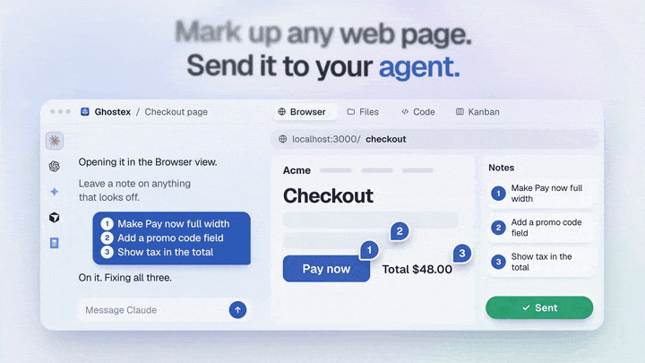</a></td>
    </tr>
    <tr>
      <td width="50%" align="center"><a href="#your-agents-in-your-pocket">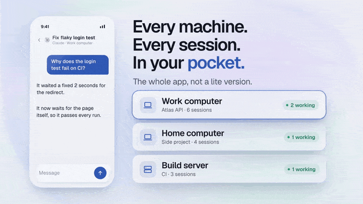</a></td>
      <td width="50%" align="center"><a href="#find-any-chat-you-ever-had">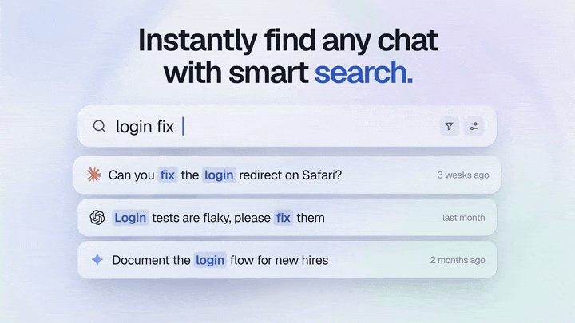</a></td>
    </tr>
    <tr>
      <td width="50%" align="center"><a href="#accounts-and-usage">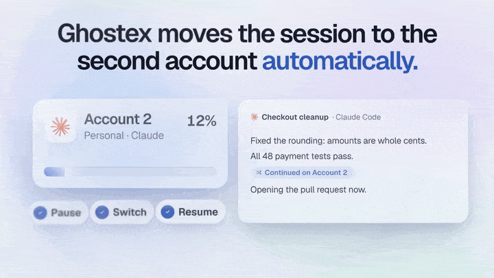</a></td>
      <td width="50%" align="center"><a href="#plugins-you-install-only-when-you-want-them">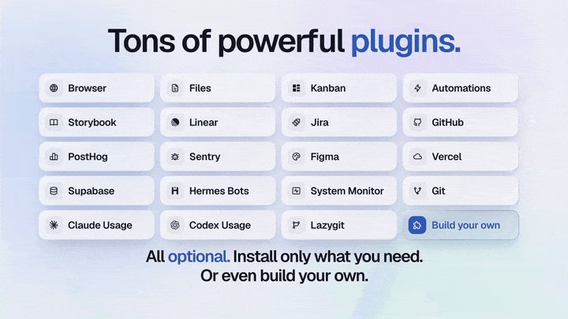</a></td>
    </tr>
  </table>
</div>

Ghostex is for developers who keep many agents alive at once. Claude Code, Codex, OpenCode, Gemini and 20+ other agent CLIs run in real Ghostty terminals, and every one of them gets a proper chat view on top. The shell is native Rust and GPUI (no Electron, no Tauri), the browser is real Chromium, and every session survives restarts. Your phone and your other computers join the same workspace.

<p align="center">
  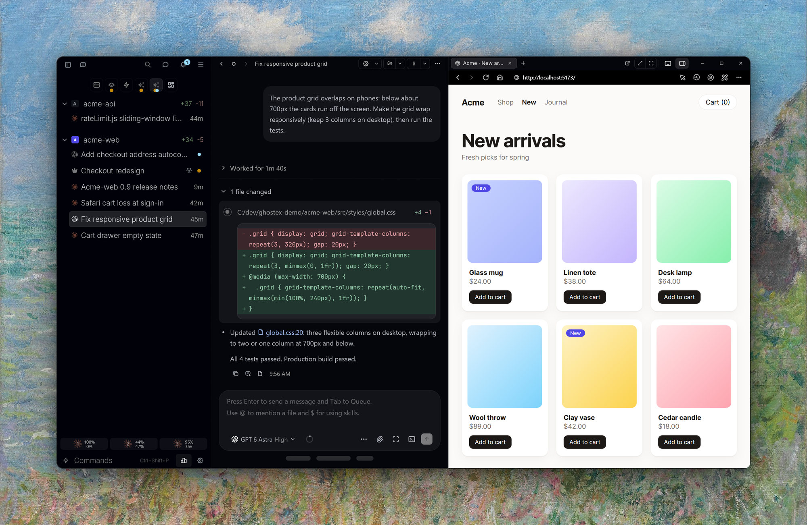
</p>

## Features

### A real chat for every agent

Talk to any agent in a chat that reads like the ChatGPT and Claude apps: thinking, tool calls and file edits fold into tidy cards, diffs are readable, images are clickable, prompts queue while the agent works, and sub-agents stay in view. It is still the agent's own CLI underneath, so nothing breaks when the CLI updates, and the raw terminal is one hotkey away with your draft intact.

<p align="center">
  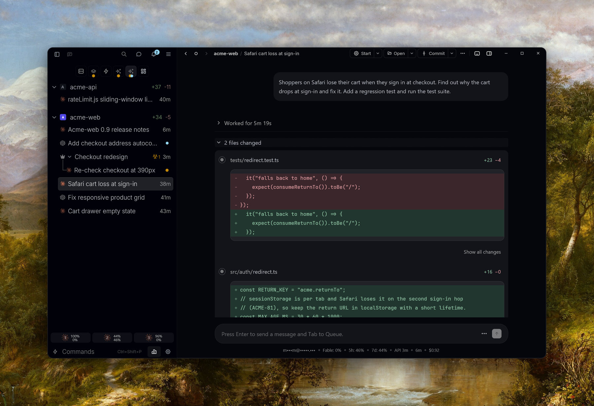
</p>

<table>
<tr>
<td width="50%" valign="top">

**Questions and approvals are cards, not terminal menus.** Pick an option, write your own answer, or skip, and the answer reaches the agent as if you had typed it in its terminal.

</td>
<td width="50%" valign="top">

**Chat and terminal, side by side.** Drag any session onto a pane edge to split. Each pane can show the chat or the real Ghostty terminal underneath.

</td>
</tr>
<tr>
<td width="50%">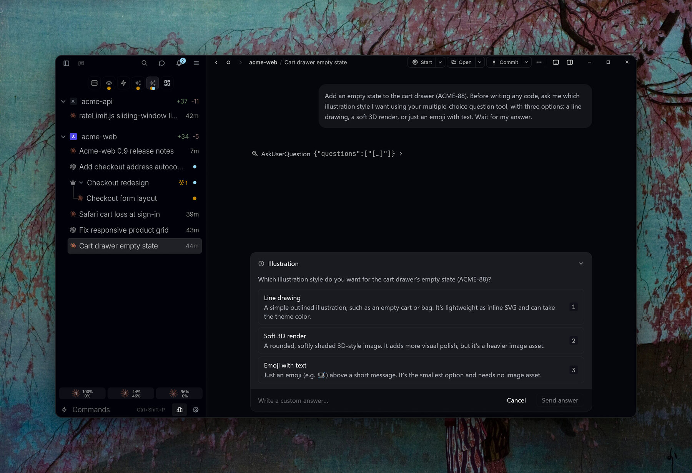</td>
<td width="50%">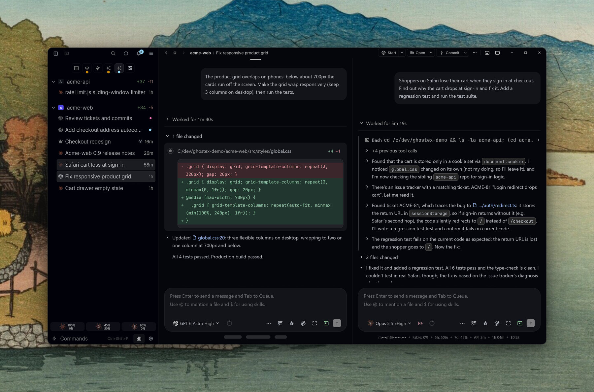</td>
</tr>
</table>

### Coordinators that run the work

Tell a coordinator what needs doing and it hands each piece to a thread: an ordinary agent session it starts, briefs, and keeps track of, in its own git worktree when threads should run in parallel. Threads sit under the coordinator in the sidebar, their reports come back on their own, and the coordinator checks and commits the work, then tells you what needs you. Start one from any project's agent menu with **New Coordinator…**, or turn a running session into one with **Make Coordinator**.

<p align="center">
  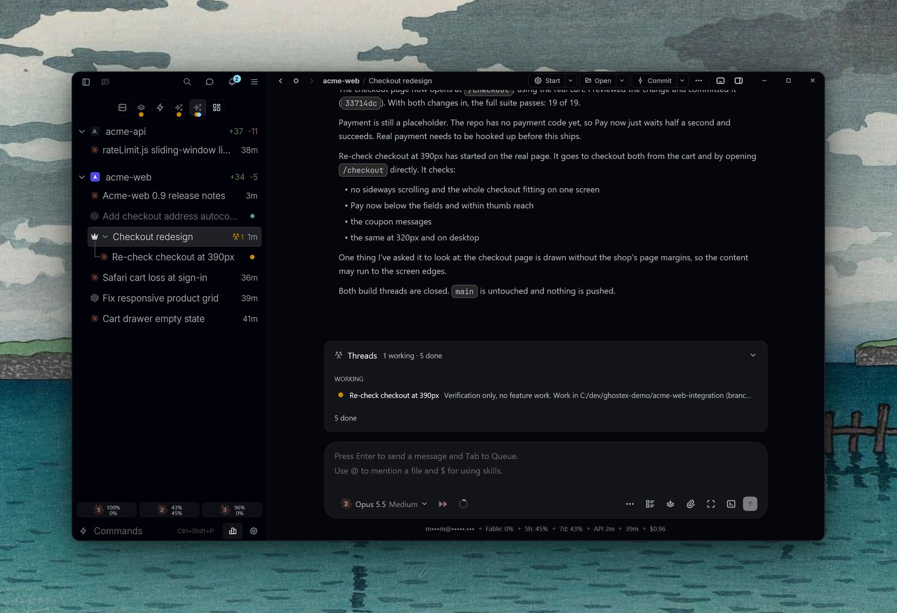
</p>

### Any agent, swap on the fly

Claude Code, Codex, OpenCode, Pi, Gemini, Grok, Cursor, Copilot, Antigravity, Hermes and more. Pick the model and effort from the chat box, hand a conversation from one agent to another mid-task, and let agents message each other through the `ghostex` CLI:

```bash
ghostex agents create codex --task "Run the checkout tests and report back"
ghostex agents send "Checkout redesign" "Tests pass, ready for review"
ghostex read-session-chat "Checkout redesign" --all --format text
```

### Real terminals when you want them

Every session is a real Ghostty terminal, kept alive by its own session daemon, so agents keep running when you close the window, restart the app or update it. Split panes, a command terminal under your work, and `ghostex attach` from any shell, even over SSH.

<p align="center">
  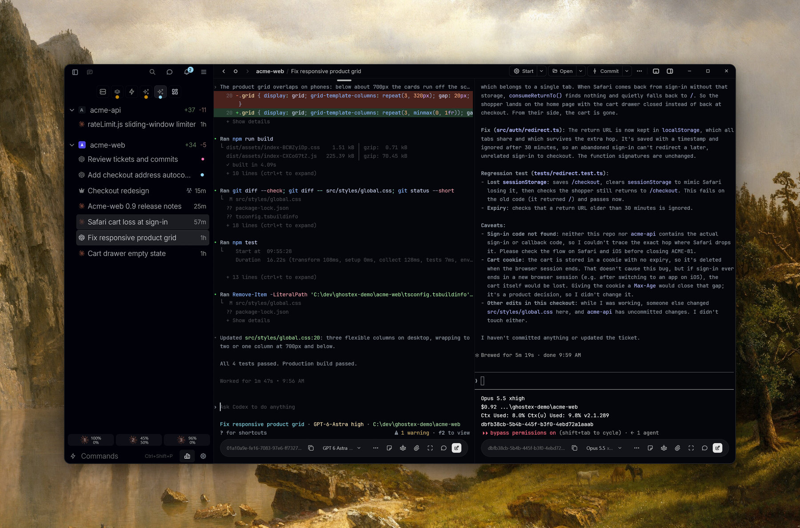
</p>

### A real browser next to your agents

Open your dev server in an embedded Chromium tab beside the chat. Click any element, type what should change, and the note lands in the agent's prompt. Agents can drive the browser themselves through the built-in browser-use skill, and Markdown plans and HTML prototypes in the Files view get the same annotations.

<p align="center">
  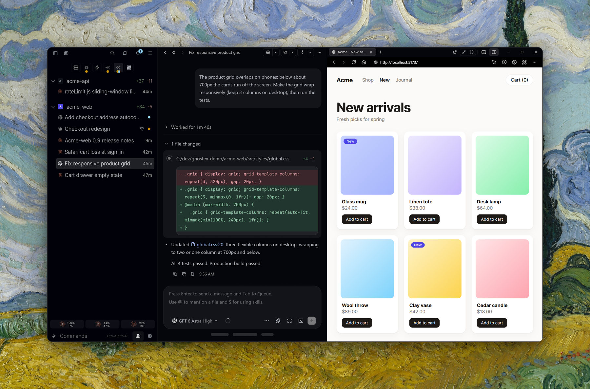
</p>

### Kanban board and automations

A project board on the [Beads](https://github.com/gastownhall/beads) `bd` CLI, so agents and humans share one backlog: dump tickets on it, start an agent on a card, and the card shows who is working on it. Automate schedules agent work per project (daily, weekly, cron, or once) in your checkout, a fresh worktree or an existing thread.

<p align="center">
  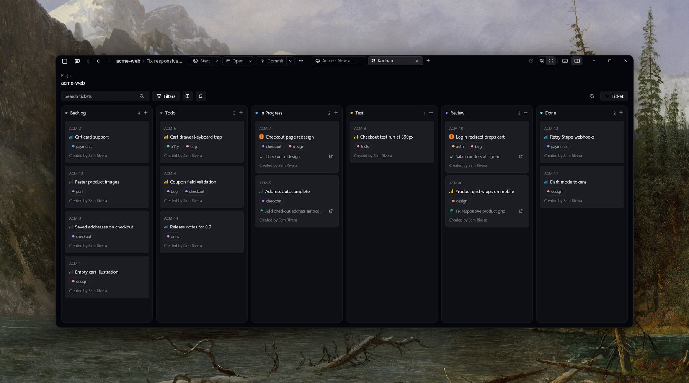
</p>

<p align="center">
  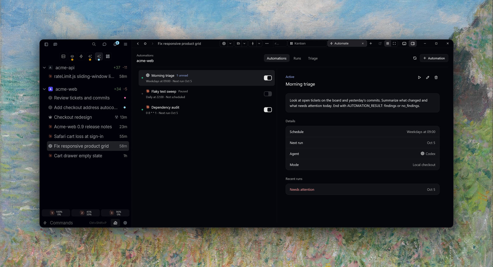
</p>

### Your agents in your pocket

The Android and iOS apps show every computer you connect, with their projects and sessions. Read transcripts, answer questions, send follow-ups, preview localhost pages and get a push when an agent finishes. **Easy Connect** pairs your phone with one QR scan and no extra accounts, or join through Tailscale if you already use it. Other computers join the same way and show up in the sidebar.

<p align="center">
  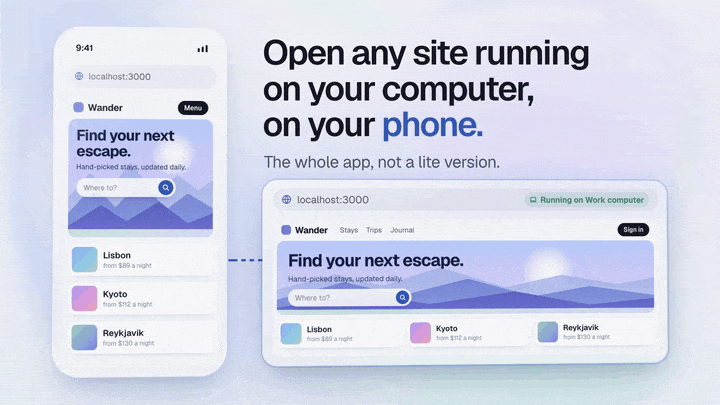
</p>

### Find any chat you ever had

Fuzzy-search every prompt you ever sent, across every agent and project, and press Enter to resume that conversation. Star favourites and filter by agent or project. Also in the terminal as `gx f`.

### Accounts and usage

Add several Claude and Codex accounts, see their limits in the status line, and let Ghostex move a session to another account automatically when one runs out.

### Plugins you install only when you want them

Browser, Files, Kanban, Automate, VS Code, Storybook, Linear, Jira, GitHub, Sentry, Figma, Vercel, Supabase, PostHog, Hermes bots and more. Every view is optional, sleeps when idle, and you can build your own extensions.

**Also in the box:** the Ctrl+G rich prompt editor, worktrees per task, Spaces, Floating Capture for prompting from any app, Cloud Boxes for agents in a sandbox, window glass and themes, notifications and sounds, multiple windows, and Keep Awake.

---

## Supported agents

Works with **any coding agent**. Bring the one you already use.

<p>
  <a href="https://docs.anthropic.com/claude/docs/claude-code"><kbd> Claude Code</kbd></a> &nbsp;
  <a href="https://github.com/openai/codex"><kbd> Codex</kbd></a> &nbsp;
  <a href="https://opencode.ai"><kbd> OpenCode</kbd></a> &nbsp;
  <a href="https://pi.dev"><kbd> Pi</kbd></a> &nbsp;
  <a href="https://omp.sh"><kbd> oh-my-pi</kbd></a> &nbsp;
  <a href="https://github.com/google-gemini/gemini-cli"><kbd> Gemini CLI</kbd></a> &nbsp;
  <a href="https://x.ai/cli"><kbd> Grok</kbd></a> &nbsp;
  <a href="https://cursor.com/cli"><kbd> Cursor</kbd></a> &nbsp;
  <a href="https://github.com/features/copilot/cli"><kbd> Copilot CLI</kbd></a> &nbsp;
  <kbd>+ many more</kbd>
</p>

---

## Install

### macOS

```bash
brew install ghostex
```

Or download the app directly:

<p>
  <a href="https://maddada.com/download/macos-arm64"><picture><source media="(prefers-color-scheme: dark)" srcset="https://shieldcn.dev/badge/macOS-Apple%20Silicon%20DMG.svg?variant=secondary&logo=apple&mode=dark" /></picture></a>
</p>

### Windows

<p>
  <a href="https://maddada.com/download/windows-x64"><picture><source media="(prefers-color-scheme: dark)" srcset="https://shieldcn.dev/badge/Windows-x64%20Setup.svg?variant=secondary&logo=windows&mode=dark" /></picture></a>
  <a href="https://maddada.com/download/windows-arm64"><picture><source media="(prefers-color-scheme: dark)" srcset="https://shieldcn.dev/badge/Windows-ARM64%20Setup.svg?variant=secondary&logo=windows&mode=dark" /></picture></a>
</p>

Agents run in native PowerShell with your Windows folders by default. Prefer Linux? Switch to WSL in Settings > General > Terminal > Windows Environment. Portable ZIPs are on the [release page](https://github.com/maddada/Ghostex/releases/latest), and updates arrive automatically.

### Linux

<p>
  <a href="https://maddada.com/download/linux-deb-x64"><picture><source media="(prefers-color-scheme: dark)" srcset="https://shieldcn.dev/badge/Linux-.deb.svg?variant=secondary&logo=debian&mode=dark" /></picture></a>
  <a href="https://maddada.com/download/linux-rpm-x64"><picture><source media="(prefers-color-scheme: dark)" srcset="https://shieldcn.dev/badge/Linux-.rpm.svg?variant=secondary&logo=redhat&mode=dark" /></picture></a>
  <a href="https://aur.archlinux.org/packages/ghostex-bin"><picture><source media="(prefers-color-scheme: dark)" srcset="https://shieldcn.dev/badge/AUR-ghostex--bin.svg?variant=secondary&logo=archlinux&mode=dark" /></picture></a>
  <a href="https://maddada.com/download/linux-tar-x64"><picture><source media="(prefers-color-scheme: dark)" srcset="https://shieldcn.dev/badge/Linux-tar.zst.svg?variant=secondary&logo=linux&mode=dark" /></picture></a>
</p>

```bash
# Arch Linux
yay -S ghostex-bin

# Any other x64 distribution: the tarball is a prefix-preserving /opt/ghostex tree
sudo tar -xpf ghostex-*-linux-x64.tar.zst -C /
```

The browser and code editor run on Chromium, which Ghostex offers to install the first time you open one of them.

### Mobile

<p>
  <a href="https://github.com/maddada/Ghostex/releases/latest/download/ghostex-android.apk"><picture><source media="(prefers-color-scheme: dark)" srcset="https://shieldcn.dev/badge/Android-APK.svg?variant=secondary&logo=android&mode=dark" /></picture></a>
  <a href="https://discord.gg/df7b3G92CS"><picture><source media="(prefers-color-scheme: dark)" srcset="https://shieldcn.dev/badge/iOS-TestFlight.svg?variant=secondary&logo=apple&mode=dark" /></picture></a>
</p>

The iOS TestFlight runs through the [Discord](https://discord.gg/df7b3G92CS). Post in the iOS channel to get in. Then open **Mobile & Remote** in the sidebar's More Options on your computer and scan the code.

### Build from source

See [CONTRIBUTING.md](CONTRIBUTING.md#building-from-source).

## Comparison

| Feature                   | Ghostex | ChatGPT app | cmux |
| ------------------------- | ------- | ----------- | ---- |
| macOS support             | Yes     | Yes         | Yes  |
| Windows support           | Yes     | Yes         | No   |
| Linux support             | Yes     | Yes         | No   |
| Open source               | Yes     | -           | Yes  |
| Ghostty terminal          | Yes     | -           | Yes  |
| Chromium Browser          | Yes     | Yes         | No   |
| Chat GUI view             | Yes     | Yes         | No   |
| Fully featured IDE        | Yes     | -           | -    |
| Built-in Computer use     | Yes     | Yes         | -    |
| Built-in Browser use      | Yes     | Yes         | Yes  |
| Use any model             | Yes     | -           | Yes  |
| Cross Model Orchestration | Yes     | -           | Yes  |
| Rich Prompt Editor        | Yes     | N/A         | -    |
| iOS                       | Yes     | Yes         | Yes  |
| Android                   | Yes     | Yes         | Yes  |
| Automations               | Yes     | Yes         | -    |

---

## Community

- **Discord:** [discord.gg/df7b3G92CS](https://discord.gg/df7b3G92CS) for help, TestFlight access, and feature talk.
- **Issues:** [Report a bug or request a feature](https://github.com/maddada/Ghostex/issues).
- **Contributing:** Ghostex moves fast and help is welcome on platform ports, agent integrations, docs, and polish. Start with [CONTRIBUTING.md](CONTRIBUTING.md).

<p align="center">
  <a href="https://github.com/maddada/Ghostex/graphs/contributors"><picture><source media="(prefers-color-scheme: dark)" srcset="https://shieldcn.dev/contributors/maddada/Ghostex.svg?bg=transparent&border=false&mode=dark" /></picture></a>
</p>

## Credits

Ghostex builds on open source work from these projects and communities:

- [Ghostty](https://github.com/ghostty-org/ghostty) and [Zed / GPUI](https://github.com/zed-industries/zed) for the terminal and the native shell
- [CEF](https://github.com/chromiumembedded/cef) for embedded Chromium panes
- [Trycua](https://github.com/trycua/cua) for built-in Computer Use
- [VS Code](https://github.com/microsoft/vscode) and [code-server](https://github.com/coder/code-server) for the embedded IDE
- [Beads](https://github.com/gastownhall/beads) by [Steve Yegge](https://github.com/steveyegge) and [Beads Viewer](https://github.com/Dicklesworthstone/beads_viewer) for the Kanban board
- [OpenUsage](https://github.com/robinebers/openusage) for Claude and Codex usage stats
- [Agentation](https://github.com/benjitaylor/agentation) for browser annotation tooling
- [cmux](https://github.com/manaflow-ai/cmux) for agent hook and notification patterns
- [zehn](https://github.com/al3rez/zehn) by [al3rez](https://github.com/al3rez) for prompt-history search
- [vvterm](https://github.com/vivy-company/vvterm) and [Termux](https://github.com/termux/termux-app) for mobile terminal components
- [Pierre](https://github.com/pierrecomputer/pierre) for diff and file rendering components

Screenshot backdrops are public-domain paintings and prints: Claude Monet, *Cliff Walk at Pourville* (1882); Kawase Hasui, *Shinagawa Offshore* and *Lake Kugushi*; Yoshida Hiroshi, *Kumoi Cherry Trees* (1920); Frederic Edwin Church, *Heart of the Andes* (1859); Albert Bierstadt, *Canadian Rockies (Lake Louise)* and *Merced River, Yosemite Valley* (1866).

## License

Ghostex is free and open source under the [MIT License](LICENSE).
